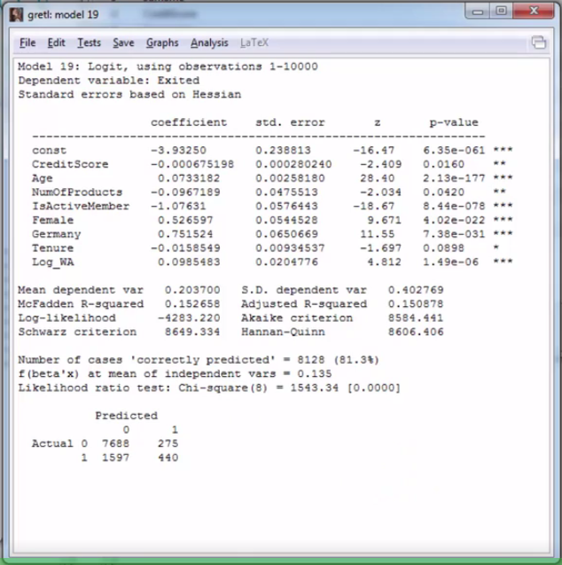
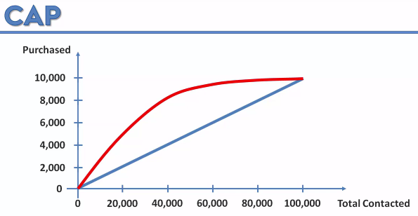
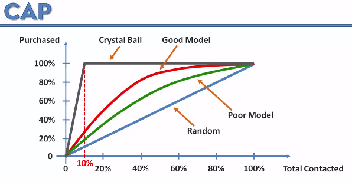
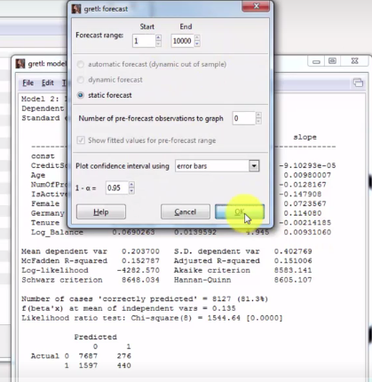
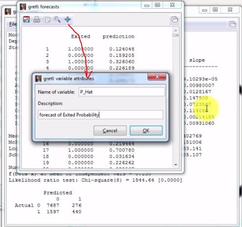
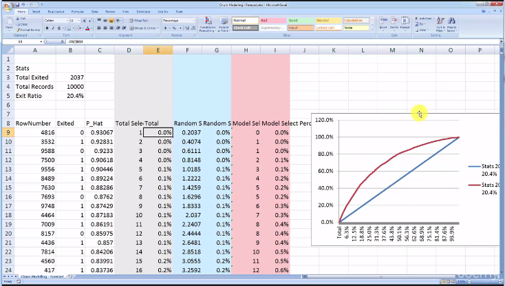
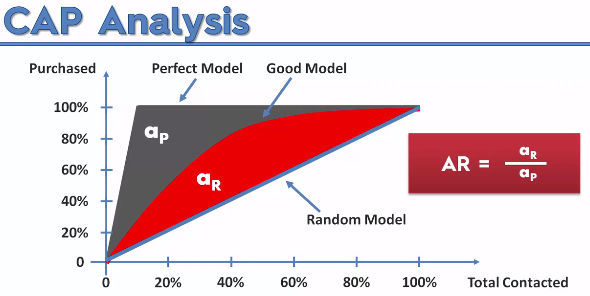
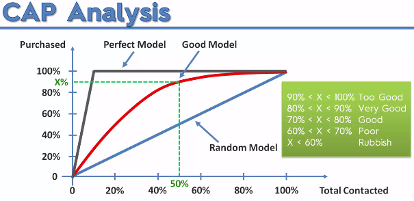

[web site with data Under dev-t](http://superdatascience.com/)

Check Gretl stochastic coefficients 

## Section 12 Geodemographic Segmentation
###Lecture 72 Step by step building Geodemographic model
- predict churn of customers
- step by step (backward elimination algorithm) remove variable with highest p-value (on each step gretl suggest the 1st candidate for removal)
- remove 'tenure' var, adj R-squared drop a bit, return 'tenure' var back to model
###Lecture 73 Transforming independent variables
- apply sqrt(), pow2() or ln() to variable to transform it
- add formula as new variable `Log_Balance = log10(Balance+1)` 
- you also may introduce dummy var for balance eq 0 and log10() for everything else
- Remove *Balance* and add *Log_Balance* to model
##Lecture 74 Creating derived variables
- candidate for derived variable - (balance and age) bigger balance for high age is normal, but bigger balance for low age is something different
- So, add formula as new variable `WealthAccumulation= Balance/Age`
- add WealthAccumulation to model
- adj R-squared and accuracy (`correctly predicted`) drop a bit both, but 
- suggest that *WealthAccumulation*, *Log_Balance* and *Age* might be correlated and damage the model
##Lecture 75 Checking for multicollinearity effect using VIF (variance inflation factors)
- use of VIF for independent variables correlation detection
- use Gretl's menu -> Test -> Collinearity -> open VIF report
- formula for VIF is VIF(j) = 1/(1-R(j)^2)
- find variables with VIF >10 or values which much higher than others
- remove *Log_Balance* re-run the model
- p-value for *WealthAccumulation* significantly bigger and even change sign
- re-run Collinearity -> open VIF report -> check that collinearity drop for *WealthAccumulation*
- create log vaviable for *WealthAccumulation* `Log_WealthAccumulation= log10(Balance/Age+1)`
- remove *WealthAccumulation* and add *Log_WealthAccumulation* and *Log_Balance* and re-run the model
- check improvance in their p-values and model's adj R-square
- check VIF for them they are way too hight ( >700 ) -> one of them should be excluded
- so remove *Log_WealthAccumulation*
##Lecture 76 Correlation matrix and  multicollinearity intuition
- use Gretl's menu -> View -> Correlation matrix 

##Section 13 Assessing your model
###Lecture 78. Intro (what you will learn in this section)
###Lecture 79. Accuracy paradox
###Lecture 80. Cumulative Accuracy Profile (CAP)
-  
- Cristal ball is where you predict 10% of those who should be called 
- ROC - Receiver Operating Characteristic (look article in wiki)
- CAP != ROC
###Lecture 81. How to build a CAP curve in Excel
- use Gretl's menu -> Analysis -> Forecasts 
- add as variable P_hat_probabillity 
- menu-> export (row number, exited and p_hat) to excel
- import csv file to excel
- Result in excel 
###Lecture 82. Assessing your model using the CAP curve
- AssessmentCap 
- Better and Easy Way To Assess Cap 

###Lecture 83. Get my CAP curve template
###Lecture 84. How to use test data to prevent overfitting your model
###Lecture 85. Applying the model to test data
###Lecture 86. Comparing training performance and test performance
###Lecture 87. Section Recap

##Section Section 14 Drawing insights from your model

Check Gretl stochastic coefficients 

