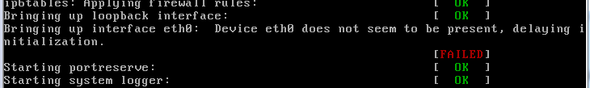
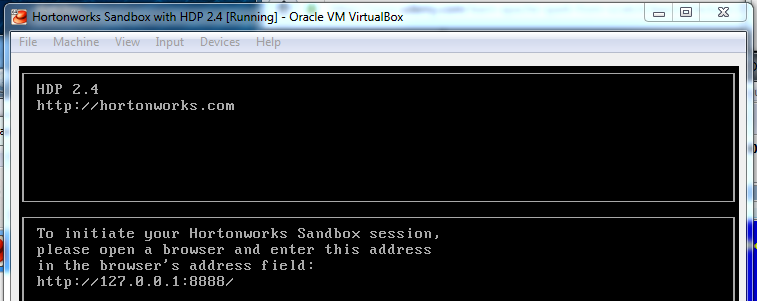
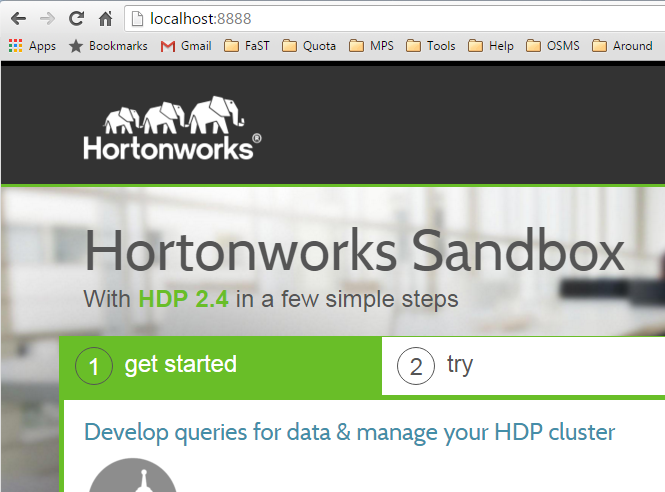

## VmWare
- open VmWare Workstation and just open c:\WWWDownload\Hortonworks_sanbox_with_hdp_2_4_vmware.ova
- try to open http://192.168.217.129/ in chrome

```
During vm initialization I can see "bringing up interface eth0 device eth0 does not seem to be present delaying initialization" in console.
```
- Error screenshot 

## VirtualBox 
- install Oracle [VirtualBox](https://www.virtualbox.org/wiki/Downloads)    
- 
- 
- SSH with putty (host 127.0.0.1, port 2222, username root) 
- required by system change password to *alex140839* (original *hadoop*)

- [Welcome to Hortonworks Sandbox](http://localhost:8888/)
- [Welcome to Ambary](http://localhost:8080/)
- [Welcome to Zeppelin](http://localhost:9995/#/)


- check out [tutorials](http://hortonworks.com/tutorials/)
- [Hands-on Tour of Apache Spark in 5 Minutes](http://hortonworks.com/hadoop-tutorial/hands-on-tour-of-apache-spark-in-5-minutes/)
- Prerequisites [Learning the Ropes of the Hortonworks Sandbox](http://hortonworks.com/hadoop-tutorial/learning-the-ropes-of-the-hortonworks-sandbox/)

- Further Reading
1. To learn more about Hadoop please explore the [HDP Getting Started documentation](http://docs.hortonworks.com/HDPDocuments/HDP2/HDP-2.2.4/bk_getting-started-guide/content/ch_about-hortonworks-data-platform.html).
2. To get started with Hortonworks Data Platform, explore [Hadoop Tutorial-Getting Started with HDP](http://hortonworks.com/hadoop-tutorial/hello-world-an-introduction-to-hadoop-hcatalog-hive-and-pig/)
3. If you have questions, feedback or need help getting your environment ready visit  [developer.hortonworks.com](http://hortonworks.com/developer/).
4. Please also explore the [HDP documentation](http://docs.hortonworks.com/).
5. [Hortonworks Community Connection(HCC)](http://hortonworks.com/community/)

