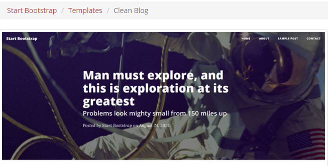
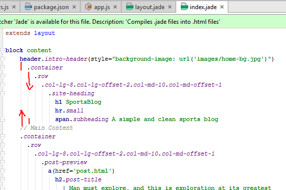
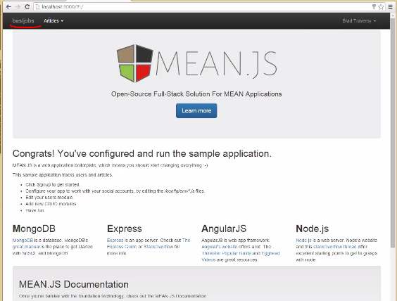

# Projects In ExpressJS LearnExpressJsBuilding 10 projects

## Section: 1 - Introduction
### Lecture 1: Introduction

## Section: 2 - Simple Express Server
### Lecture 2: Project Intro
### Lecture 3: Environment Setup
### Lecture 4: Sending a Response
### Lecture 5: Static Web Server
### Lecture 6: Package.json & More Requests - Basics
### Lecture 7: Package.json & More Requests - Advance
## Quiz 1: Chapter 1

## Section: 3 - PC Repair Website
### Lecture 8: Project Intro
### Lecture 9: Express Generator
- see http://expressjs.com/en/starter/generator.html
    - npm install -g express-generator
    - express myapp
    - cd myapp
    - npm install
    - these commands layout project structure

    ├── app.js
    ├── bin
    │   └── www
    ├── package.json
    ├── public
    │   ├── images
    │   ├── javascripts
    │   └── stylesheets
    │       └── style.css
    ├── routes
    │   ├── index.js
    │   └── users.js
    └── views
        ├── error.jade
        ├── index.jade
        └── layout.jade     
    - and than _npm install_ to install required by generator
    - npm start
    - install bootstrap client side css and js
- html2jade.org - jade converter  

### Lecture 10: Jade Layouts
### Lecture 11: Fetching JSON
### Lecture 12: Nodemailer Contact
- Nodemailer github.com/andris9/Nodemailer

### Quiz 2: Chapter 2 ## Quiz

## Section: 4 - SportsBlog Application
### Lecture 13: Project Intro
### Lecture 14: MongoDB & Middleware
- install MongoDb from mongodb.org (download c:\WWWDownload\mongodb-win32-x86_64-2008plus-ssl-3.2.1-signed.msi)
    - open cmd as Administrator
    - cd C:\Program Files\MongoDB\Server\3.2\bin
    - create forlders in root c:\mongodb\data\db\
    - create log c:\mongodb\log\mongo.log

    C:\Program Files\MongoDB\Server\3.2\bin>mongod --directoryperdb --dbpath c:\mongodb\data\db --logpath c:\mongodb\log\mon
    go.log --logappend --rest --install
    2016-01-24T12:46:07.432-0500 I CONTROL  [main] ** WARNING: --rest is specified without --httpinterface,
    2016-01-24T12:46:07.432-0500 I CONTROL  [main] **          enabling http interface
    C:\Program Files\MongoDB\Server\3.2\bin>net start MongoDB
    The MongoDB service was started successfully.    
    
    - to stop service use > net stop MongoDB (or through control panel>services)
    - set path to c:\Program Files\MongoDB\Server\3.2\bin
    - verify in cmd >mongo and than
    
    >show databases 
    local  0.000GB

- add to package.json

     
    "connect-flash": "*",
    "express-messages":"*",
    "express-session":"*",
    "express-validator":"*",
    "moment":"*",
    "mongoose":"*"

- install nodemon: add "main": "bin/www" in  package.json
    >npm install -g nodemon

- npm install (all added modules)
    - gyp ERR! stack Error: Can't find Python executable "python", you can set the PYTHON env variable.
    - need come back and install python
        - python-3.5.1 to c:\WWWDownload
        - add path to C:\Users\Alexei\AppData\Local\Programs\Python\Python35-32   <-  python.exe
        
- nodemon in project folder        
- setup middleware in app.js (copy from downloaded project source zip)
- visit startbootstrap.com 
    - click browse theme and template
    - select Clean Blog and download 
    
    - copy css and javascript from zip
    - copy \fonts and \img from zip to public directory

### Lecture 15: Routes & Views - Basics
### Lecture 16: Routes & Views - Concepts

- Error in rendering. on 51st second not clear what indent should be in _pasted code_ 
    
    - backup after fixing error c:\WebstormProjects\SportsBlog.src\backup\SportsBlogBackupLecture16_1stMinute.zip
    - backup after lecture completed c:\WebstormProjects\SportsBlog.src\backup\SportsBlogBackupLecture16_completed.zip
    
### Lecture 17: Routes & Views - Implementation

### Lecture 18: Categories - Basics
- create and put initial sample data in mongo db
    - open cmd in Admin mode
    - cd to mongo bin directory and start _mongo_ (Since I've set PATH to mongo\...\bin I type _mongo_ in c drive)

    C:\Users\Alexei>mongo 
    2016-01-24T14:03:00.817-0500 I CONTROL  [main] Hotfix KB2731284 or later updateis not installed, will zero-out data files 
    MongoDB shell version: 3.2.1 
    connecting to: test 
    Server has startup warnings: 
    2016-01-24T12:46:59.142-0500 I CONTROL  [main] ** WARNING: --rest is specified without --httpinterface, 
    2016-01-24T12:46:59.143-0500 I CONTROL  [main] **          enabling http interface 
    > show databases 
    local  0.000GB 
    > show databases 
    local  0.000GB 
    > db 
    test 
    > use sportsblog 
    switched to db sportsblog 
    > db 
    sportsblog 
    > db.createCollection('categories') 
    { "ok" : 1 } 
    > show collections 
    categories 
    > db.categories.insert({title:'Baseball', description:'These are baseball articles'});
    WriteResult({ "nInserted" : 1 }) 
    > db.categories.insert({title:'Bike race', description:'These are bike race articles'}); 
    WriteResult({ "nInserted" : 1 }) 
    > db.categories.find() 
    { "_id" : ObjectId("56a6c301df3122128a52fee9"), "title" : "Baseball", "description" : "These are baseball articles" } 
    { "_id" : ObjectId("56a6c322df3122128a52feea"), "title" : "Bike race", "description" : "These are bike race articles" } 
    
### Lecture 19: Categories - Concepts
### Lecture 20: Categories - Implementation
### Lecture 21: Articles - Introduction
### Lecture 22: Articles - basic Structure
### Lecture 23: Articles - Implementation
### Lecture 24: Articles - Final View
### Lecture 25: Comments
- save final project to _c:\WebstormProjects\SportsBlog.src\SportsBlog25Final.zip_
## Quiz 3: Chapter 3 ## Quiz

## Section: 5 - User Login System
### Lecture 26: Project Intro
### Lecture 27: Handlebars & Dependencies
- Passport - authentication packages
- bcrypt
- generate app with express generator ()we'll use webStorm 
    - type `express passport` in cmd
- add bcryptjs (bcrypt - is too heavy and have many dependencies)
- to use node mon add "main": "bin/www",
- etc. see package.json in C:\WebstormProjects\passport
- replace `jade` with `"express-handlebars":"*"` in package.json and set engine in app.js 
    - set the engine `app.engine('handlebars', exphbs({defaultLayout:'layout'}));`
    - replace jade `app.set('view engine', 'handlebars');`
    - also we need to include it `var exphbs = require('express-handlebars');`
    -  rename *.jade to *.handlebarss

### Lecture 28: User Interface - Basic
### Lecture 29: User Interface - Implementation
### Lecture 30: Registration - Initial Steps
- [Passport web site](http://passportjs.org/)
- to setup passport create middleware config file `passport\config\passport.js`
- and database C:\WebstormProjects\passport\models\user.js
### Lecture 31: Registration - Basic
### Lecture 32: Registration - Final Implementation
### Lecture 33: Login
## Quiz 4: Chapter 4 ## Quiz

## Section: 6 - Chat Using Socket.io
### Lecture 34: Project Intro 
- Create eChat app
### Lecture 35: App & Dependency Setup
- socket.io

### Lecture 36: Bootstrap UI
### Lecture 37: Adding Usernames
### Lecture 38: Sending Chat Messages
## Quiz 5: Chapter 5 ## Quiz

## Section: 7 - ClientKeeper
### Lecture 39: Project Intro
- project use mongojs [google: mongojs vs mongoose](https://www.google.ca/search?q=mongojs+vs+mongoose&ie=utf-8&oe=utf-8&gws_rd=cr&ei=FeW_VsKYOMSuevHtirgE)

### Lecture 40: Server & Client Files - Basic
- downloadable project zip
- will use `c:\clientkeeper>node app` to start server
    - check what the difference between `node app` and `C:\WebstormProjects\HeroesAng2>npm start`

### Lecture 41: Server & Client Files - Implementation
- install bower 
    - c:\clientkeeper> npm install bower -g
- after  create basic folder structure for express app with static folder
    - cd to public
    - c:\clientkeeper\public>bower install angular --save
    - that's create new folders with angular under public `\bower_components\angular`
    - c:\clientkeeper\public>bower install bootstrap --save
    - that also install jQuery
- copy and paste navbar from getbootstrap.com->getStarted->examples->bootstrap starter template-> get source-> copy `<nav>...</nav>`
- bootswatch.com to select different theme copy and paste bootstrap.css to replace standard bootstrap.css
- getbootstrap->CSS->table-> striped table
- insert table with columns and editor row
- remove `navbar-fixed-top` from navbar

### Lecture 42: Getting the Clients
- in cmd wnd go to mongodb/bin directory `c:\program files\mongoDB\Server\3.0\bin` and run `mongo`
- mongo>show dbs
- mongo>use clientkeeper
    - mongo>switched to db clientkeeper
- mongo>show collections
    - none yet
- mongo>db.createCollection('clients')
    - confirm db and collection existence
    - mongo>show collections - shows clents
    - mongo>show dbs - shows clientkeeper
    - mongo>db.clients.find() - shows nothing
    - mongo>db.clients.insert({first_name:'John',last_name:'Doe', email:'test@g.com',phone:'416-576-9967'});
    - mongo>db.clients.find() - shows record
    - mongo>db.clients.find().pretty() - shows nice formatted record
    
- in express `app.js` connect to specific database in mongo by
    var mongojs = require('mongojs');
    var db = mongojs('clientkeeper',['clients']);

- introduce angular's AppController.js

### Lecture 43: Getting the Clients - Final Steps
### Lecture 44: Adding Clients
### Lecture 45: Update & Delete Clients - Basics
### Lecture 46: Update & Delete Clients - Implementations
## Quiz 6: Chapter 6 ## Quiz

## Section: 8 - Job Board Using MEAN.js
### Lecture 47: Project Intro
- use [MEAN.js](meanjs.org)
- use YO generator
- use of modules on front and back ends
- use of Angular filters
### Lecture 48: Mean.js Setup
- create project folder `bestjobs`
- install bower 
    - c:\bestjobs> npm install -g bower 
- install python from python.org 
- will not install `Visual studio Express`
- install grunt 
    - c:\bestjobs> npm install -g grunt-cli
- install express 
    - c:\bestjobs> npm install -g express
- install yo 
    - c:\bestjobs> npm install -g yo
- install yo generator for MEANJS
    - c:\bestjobs> npm install -g generator-meanjs
- generate app
    - c:\bestjobs> yo meanjs 
    - on question 'Would you like to genetrate the article example CRUD module?' answer Yes
    - you might need to install node-gyp (_have no idea what it is_)
- run server with grunt
    - c:\bestjobs> grunt
- you might need to reinstal bower angular
    - c:\bestjobs>bower install --allow-root

- These all steps generate quite application for us with:
    - sign in form (with social account support)
    - article module 
- clean up generated crap 

### Lecture 49: Creating the Jobs Module - Basics
- generate job crud module with *yo*
    - c:\bestjobs>yo meanjs:crud-module jobs

### Lecture 50: Creating the Jobs Module - Implementation
### Lecture 51: List & Details View
### Lecture 52: Edit, Delete & Filtering
## Quiz 7: Chapter 7 ## Quiz

## Section: 9 - MovieBase Using Kraken
### Lecture 53: Project Intro
- See [Kraken](kraken.com)

### Lecture 54: Kraken Setup
### Lecture 55: Kraken Setup - Final Steps
### Lecture 56: Movie Model - Basics
### Lecture 57: Movie Model - Implementation
### Lecture 58: Getting & Adding Movies
### Lecture 59: Editing & Deleting Movies
### Lecture 60: Search & Filter Movies
## Quiz 8: Chapter 8 ## Quiz

## Section: 10 - Instagram App
### Lecture 61: Project Intro
### Lecture 62: App & Kickstart Setup
### Lecture 63: The Instagram API - Basics
### Lecture 64: The Instagram API - Implementation
### Lecture 65: User Images & Lightbox
## Quiz 9: Chapter 9 ## Quiz

## Section: 11 - Bizlist Using CouchDB
### Lecture 66: Project Intro
### Lecture 67: App & CouchDB Setup
### Lecture 68: Business Routes & Views - Structure
### Lecture 69: Business Routes & Views - Implementation
### Lecture 70: Add & Fetch Businesses - Basics
### Lecture 71: Add & Fetch Businesses - Implementation
### Lecture 72: Edit, Delete & Filter Businesses
### Lecture 73: Edit, Delete & Filter Businesses - Final Steps
## Quiz 10: Chapter 10 ## Quiz

## Section: 12 - Course Summary
### Lecture 74: Course Summary